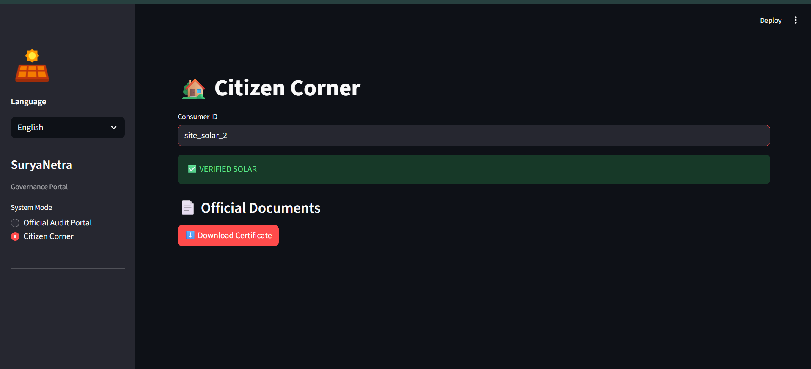

# 🛰️ SūryaNetra
### 🏆 EcoInnovators Ideathon 2026 Submission

[](https://drive.google.com/file/d/1WTkHUNNKU_nXKkVvq3th43Rs0rbY_zj8/view?usp=sharing)
> *Click the image above to watch the demo in action.*

---

## 🎯 The Challenge
**Objective:** Verify rooftop solar installations for the *PM Surya Ghar: Muft Bijli Yojana*.
**The Problem:** Field inspections are slow[cite: 8], and standard AI fails due to **GPS Drift** (satellite coordinates often miss the roof center).

## 💡 Our Solution: SūryaNetra
We built a governance-ready pipeline that combines **Computer Vision** with a **Citizen-Democratic Workflow**.

### Key Innovations
| Feature | Technical Implementation | Impact |
| :--- | :--- | :--- |
| **Swarm-Overlap Detection** | YOLOv8 + Geometric Intersection Logic | Solves GPS Drift by validating *overlap* rather than center-point containment. |
| **Dynamic Quantification** | Pixel-to-Meter conversion based on Latitude | Calculates accurate $m^2$ area for subsidy estimation. |
| **Citizen Appeal Loop** | Streamlit "Citizen Corner" Mode | Handles edge cases (tree cover, shadows) by letting citizens upload geotagged proof. |

---

## 📸 System Screenshots
| Auditor Dashboard | Citizen Appeal Interface |
| :---: | :---: |
|  |  |
| *Real-time detection with Red/Green buffer zones* | *Mobile-friendly proof upload for failed audits* |

---

## 📂 Repository Roadmap
This repository follows the submission guidelines:

* `Pipeline_code/` - The core Streamlit dashboard and inference logic.
* `Trained_model_file/` - Custom fine-tuned YOLOv8 model (`best.pt`).
* `Model_card/` - Detailed PDF explaining architecture and limitations.
* `Model_Training Logs/` - F1 Score and Loss metrics.
* `input/` - Uploaded .xlsx file is stored here
* `output/` - Output images, audits, citizen uploads and downloaded reports are saved here.
* `Prediction_files/` - JSON output files of the detections.
* `Artefacts/` - Sample detections and output proofs.

---

## 🚀 Quick Start
**Local Installation**
1. Clone the repo:
   ```bash
   git clone [https://github.com/YOUR_USERNAME/SuryaNetra.git](https://github.com/YOUR_USERNAME/SuryaNetra.git)
2. Install dependencies:
    ```bash
    pip install -r "Environment_details/requirements.txt"
3. Add Google Maps API Key:
   go to Pipeline_code/fetch_pipeline.py and replace "api-key-goes-here" with your API as directed
4. Run the pipeline:
    ```bash
    streamlit run "Pipeline_code/app.py" 
5. or use:
    ```bash
    python -m streamlit run "Pipeline_code/app.py"
